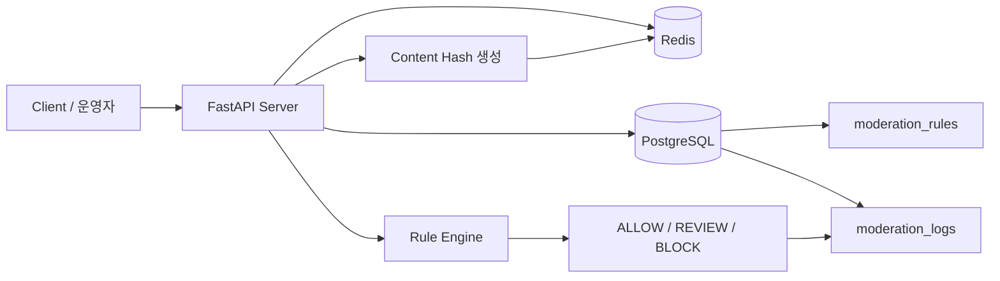
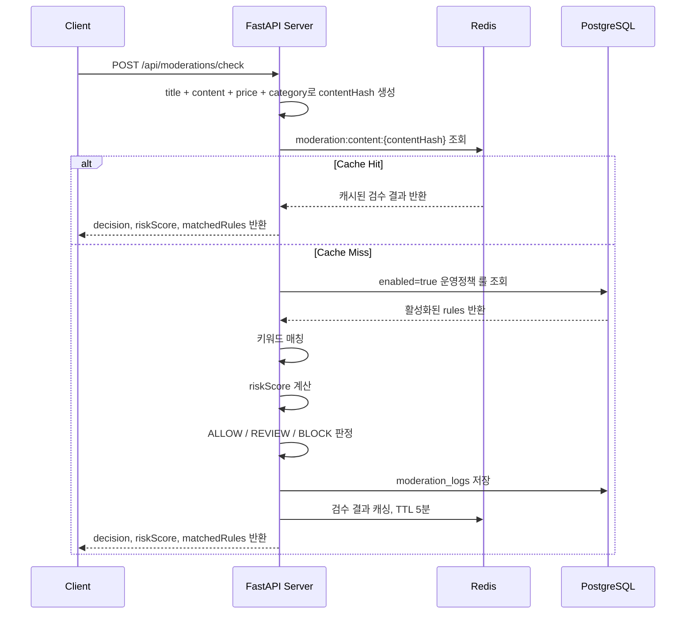
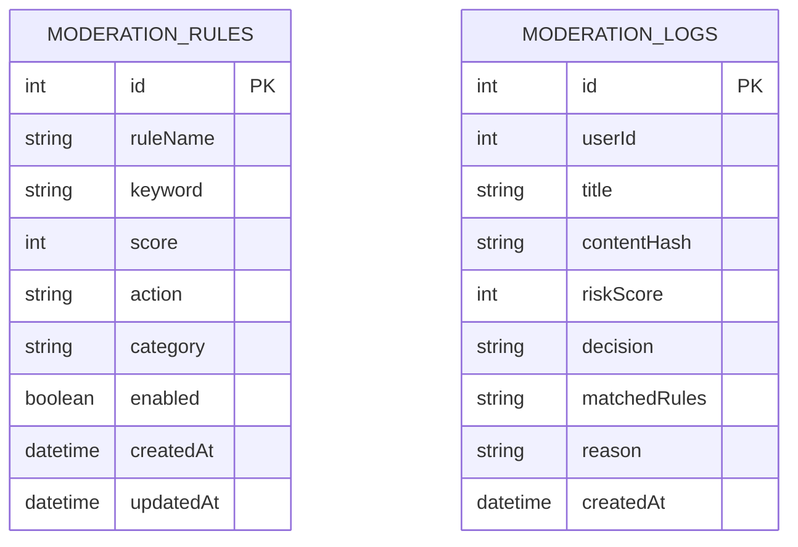

# content-safety-ops-api

 사용자가 작성한 게시글을 운영정책 룰 기반으로 자동 검수하고, 스팸/사기/어뷰징 위험도를 계산해 `ALLOW`, `REVIEW`, `BLOCK` 중 하나로 판정합니다.


| ALLOW | BLOCK | REVIEW |
|-------|-------|--------|
|  |   |    |


---

## 1. 문제 상황

운영팀은 매일 많은 게시글을 검수해야 하고, 반복적인 정책 위반 키워드 탐지와 위험도 판단은 수작업으로 처리하면 속도와 일관성이 떨어집니다.

특히 다음과 같은 패턴은 빠르게 감지해 운영자가 우선순위를 잡을 수 있어야 합니다.

- 선입금 요구
- 외부 연락 유도
- 계좌/송금 유도
- 불법 거래 키워드
- 스팸성 표현

수작업 검수만으로 처리할 경우 다음 문제가 발생할 수 있습니다.

| 문제 | 설명 |
|---|---|
| 처리 지연 | 게시글이 많아질수록 검수 대기 시간이 증가 |
| 판단 일관성 부족 | 운영자마다 정책 위반 판단 기준이 달라질 수 있음 |
| 반복 업무 증가 | 단순 키워드 검수에도 운영 리소스가 소모됨 |
| 사후 대응 가능성 | 위험 콘텐츠가 사용자에게 노출된 뒤 처리될 수 있음 |

### 문제 상황 캡처

> 위험 키워드가 포함된 테스트 게시글 예시 캡처를 넣는 영역입니다.


---

## 2. 선택한 해결 방법

본 프로젝트에서는 운영정책 룰을 코드에 하드코딩하지 않고 DB에 저장한 뒤, 활성화된 룰만 검수에 사용하도록 설계했습니다.

- 운영정책 룰을 PostgreSQL에 저장
- 제목과 본문에서 키워드 매칭
- 매칭된 룰의 점수를 합산해 위험도 계산
- 점수 기준에 따라 `ALLOW`, `REVIEW`, `BLOCK` 판정
- 검수 결과와 매칭된 룰을 PostgreSQL에 로그로 저장
- 동일 콘텐츠 재검수는 Redis 캐시로 응답

판정 기준은 다음과 같습니다.

| 점수 범위 | 판정 | 의미 |
|---|---|---|
| 0 ~ 39 | ALLOW | 정상 게시글 |
| 40 ~ 79 | REVIEW | 운영자 검토 필요 |
| 80 이상 | BLOCK | 차단 대상 |

---

## 3. 기술 스택

| 구분 | 기술 |
|---|---|
| Language | Python 3.11+ |
| Framework | FastAPI |
| Database | PostgreSQL |
| ORM | SQLAlchemy |
| Migration | Alembic |
| Validation | Pydantic |
| Cache | Redis |
| Infra | Docker Compose |
| Test | pytest |
| API Docs | FastAPI Swagger UI |

---

## 4. 아키텍처 다이어그램



### 아키텍처 캡처

> GitHub README의 Mermaid 렌더링 화면 또는 mermaid.live에서 PNG로 뽑은 이미지를 넣는 영역입니다.


---

## 5. 시스템 흐름

1. 클라이언트가 `POST /api/moderations/check`로 콘텐츠를 전송합니다.
2. 서버가 `title + content + price + category`로 `contentHash`를 생성합니다.
3. Redis에서 `moderation:content:{contentHash}` key를 조회합니다.
4. cache hit이면 룰 계산과 DB 조회 없이 즉시 응답합니다.
5. cache miss이면 활성화된 룰을 DB에서 조회합니다.
6. 제목과 본문에서 키워드를 매칭합니다.
7. 매칭된 룰의 점수를 합산해 위험 점수를 계산합니다.
8. 위험 점수 기준으로 `ALLOW`, `REVIEW`, `BLOCK`을 판정합니다.
9. 검수 로그를 PostgreSQL에 저장합니다.
10. 검수 결과를 Redis에 5분 TTL로 저장합니다.
11. 클라이언트에게 판정 결과를 반환합니다.

---

## 6. 게시글 검수 시퀀스



### 시퀀스 다이어그램 캡처

> 포트폴리오 문서에 넣기 좋은 핵심 캡처입니다.


---

## 7. ERD 다이어그램



### ERD 캡처


---

## 8. ERD 설명

### moderation_rules

운영정책 룰을 저장합니다.

| 필드 | 설명 |
|---|---|
| id | 룰 ID |
| ruleName | 룰 이름 |
| keyword | 감지 키워드 |
| score | 위험 점수 |
| action | 기본 액션 힌트 |
| category | 정책 카테고리 |
| enabled | 룰 활성화 여부 |
| createdAt | 생성 시각 |
| updatedAt | 수정 시각 |

### moderation_logs

검수 요청의 판정 결과를 저장합니다.

| 필드 | 설명 |
|---|---|
| id | 로그 ID |
| userId | 작성자 ID |
| title | 게시글 제목 |
| contentHash | 콘텐츠 해시 |
| riskScore | 위험 점수 |
| decision | 최종 판정 |
| matchedRules | 매칭된 룰 이름 목록 |
| reason | 판정 사유 |
| createdAt | 생성 시각 |

---

## 9. API 명세

FastAPI 자동 문서는 실행 후 아래 주소에서 확인할 수 있습니다.

간단한 운영 확인 UI는 실행 후 `http://localhost:8000/`에서 사용할 수 있습니다.

```text
http://localhost:8000/docs
```

### Swagger 캡처


---

### 9-1. 콘텐츠 검수 API

```http
POST /api/moderations/check
```

#### Request

```json
{
  "userId": 1,
  "title": "아이폰 싸게 팝니다",
  "content": "선입금하면 택배 보내드려요. 카톡 주세요.",
  "price": 100000,
  "category": "DIGITAL"
}
```

#### Response

```json
{
  "decision": "REVIEW",
  "riskScore": 70,
  "matchedRules": [
    "PREPAYMENT_KEYWORD",
    "EXTERNAL_CONTACT_KAKAO"
  ],
  "reason": "운영정책상 검토가 필요한 키워드가 감지되었습니다."
}
```

### 검수 API 응답 캡처


---

### 9-2. 운영정책 룰 관리 API

| Method | Endpoint | 설명 |
|---|---|---|
| POST | `/api/ops/rules` | 운영정책 룰 등록 |
| GET | `/api/ops/rules` | 운영정책 룰 목록 조회 |
| PATCH | `/api/ops/rules/{id}/status` | 운영정책 룰 활성화/비활성화 |

### 운영정책 룰 조회 캡처


---

### 9-3. 검수 로그 조회 API

```http
GET /api/ops/moderation-logs?limit=50&offset=0
```

### 검수 로그 조회 캡처


---

## 10. Redis 캐싱 전략

동일 콘텐츠에 대한 반복 검수 요청은 Redis 캐시를 통해 DB 룰 조회와 위험 점수 계산을 생략합니다.

| 항목 | 내용 |
|---|---|
| Hash Source | `title + content + price + category` |
| Hash Algorithm | SHA-256 |
| Redis Key | `moderation:content:{contentHash}` |
| TTL | 5분 |
| Cache Hit | 룰 계산과 DB 조회 생략 |
| Cache Miss | DB 룰 기반 검수 후 Redis 저장 |

### Redis 캐시 Key 예시

```text
moderation:content:3f1e9b3f2a2c9a...
```

### Redis 캐시 캡처

> Redis CLI 또는 RedisInsight에서 key가 저장된 화면을 캡처합니다.


---

## 11. 실행 방법

```bash
docker compose up --build
```

앱 컨테이너 시작 시 Alembic migration을 적용하고 초기 seed rule을 저장합니다.

### Docker 실행 캡처


---

## 12. 테스트 방법

```bash
python -m venv .venv
source .venv/bin/activate
pip install -r requirements.txt
pytest
```

테스트는 SQLite와 fake Redis를 사용해 외부 서비스 없이 실행됩니다.

### 테스트 케이스

| 테스트 | 기대 결과 |
|---|---|
| 정상 게시글 | `ALLOW` |
| 선입금 포함 게시글 | `REVIEW` |
| 선입금 + 카톡 + 계좌 포함 게시글 | `BLOCK` 또는 기준에 맞는 고위험 판정 |
| 불법 키워드 포함 게시글 | `BLOCK` |
| 동일 콘텐츠 재요청 | Redis 캐시 사용 |

### pytest 결과 캡처


---

## 13. DB 저장 결과

검수 결과는 `moderation_logs` 테이블에 저장됩니다.  
이를 통해 운영자는 어떤 게시글이 어떤 룰에 의해 검수되었는지 확인할 수 있습니다.

### moderation_logs 캡처


### moderation_rules 캡처


---

## 14. 검증 결과

아래 수치는 실제 실행 결과를 넣는 영역입니다.  
실제 측정 전에는 임의 수치를 넣지 않습니다.

| 검증 항목 | 결과 |
|---|---|
| Docker Compose 실행 | 성공 |
| Swagger 접근 | 성공 |
| 콘텐츠 검수 API | 성공 |
| 운영정책 룰 등록/조회/수정 | 성공 |
| 검수 로그 저장 | 성공 |
| Redis 캐시 저장 | 성공 |
| pytest 통과 | 성공 |

### 검증 캡처 모음

| 캡처 | 파일 경로 |
|---|---|
| Swagger 문서 | `docs/images/swagger-docs.png` |
| 검수 API 응답 | `docs/images/moderation-check-response.png` |
| 운영정책 룰 조회 | `docs/images/rules-list-response.png` |
| 검수 로그 API | `docs/images/moderation-logs-response.png` |
| PostgreSQL 로그 테이블 | `docs/images/moderation-logs-db.png` |
| Redis 캐시 키 | `docs/images/redis-cache-key.png` |
| pytest 결과 | `docs/images/pytest-result.png` |
| Docker 실행 | `docs/images/docker-compose-up.png` |

---

## 15. 당근 운영개발팀 JD와의 연결점

| 당근 운영개발팀 요구 | 프로젝트 연결 |
|---|---|
| 운영 자동화 | 운영정책 룰 기반 자동 검수 API |
| 스팸/사기/어뷰징 탐지 | 위험 키워드 기반 점수 계산 |
| 건강한 콘텐츠 도달 | `ALLOW`, `REVIEW`, `BLOCK` 판정 |
| 대용량 트래픽 고려 | Redis 캐싱으로 동일 콘텐츠 재검수 비용 감소 |
| DB/캐시 이해 | PostgreSQL, Redis 활용 |
| AI 관심 및 확장성 | pgvector, AI 보조 판단 확장 구조 제시 |
| 운영 판단 근거 | matchedRules, reason, moderation_logs 저장 |

---

## 16. 확장 방향

### 16-1. pgvector 기반 유사 위험 문구 탐지

현재는 키워드 기반 검수 방식입니다.  
추후에는 pgvector를 활용해 기존 위험 문구와 유사한 표현도 탐지할 수 있습니다.

예시:

| 기존 위험 문구 | 우회 표현 |
|---|---|
| 선입금하면 보내드릴게요 | 먼저 보내주시면 택배 접수할게요 |
| 카톡 주세요 | ㅋㅌ 주세요 |
| 계좌로 보내주세요 | ㄱㅈ로 보내주세요 |

---

### 16-2. AI 보조 판단

모든 게시글을 AI로 판단하면 비용과 응답 시간이 증가할 수 있습니다.  
따라서 `REVIEW` 판정 게시글만 AI 보조 판단 대상으로 넘기는 방식으로 확장할 수 있습니다.

```text
ALLOW → 즉시 통과
REVIEW → AI 보조 판단 또는 운영자 검수
BLOCK → 차단 또는 강한 검수 큐 등록
```

---

### 16-3. 신고 시스템 연동

사용자 신고가 들어오면 기존 검수 로그와 연결해 운영자 검수 우선순위를 높일 수 있습니다.

```text
사용자 신고
→ 기존 moderation_log 조회
→ 위험 점수 재계산
→ 운영자 검수 큐 등록
```

---

### 16-4. Slack/Discord 장애 알림

검수 API 장애나 비정상적인 BLOCK 급증 상황을 운영 채널로 알릴 수 있습니다.

| 조건 | 알림 |
|---|---|
| API 실패율 증가 | 장애 알림 |
| p95 응답 시간 증가 | 성능 저하 알림 |
| BLOCK 판정 급증 | 이상 패턴 알림 |

---

### 16-5. 운영자 관리자 화면

운영자가 직접 룰을 등록/수정/비활성화할 수 있는 관리자 화면으로 확장할 수 있습니다.

---

## 17. 주요 curl 예시

### 콘텐츠 검수

```bash
curl -X POST http://localhost:8000/api/moderations/check \
  -H "Content-Type: application/json" \
  -d '{
    "userId": 1,
    "title": "아이폰 싸게 팝니다",
    "content": "선입금하면 택배 보내드려요. 카톡 주세요.",
    "price": 100000,
    "category": "DIGITAL"
  }'
```

### 운영정책 룰 조회

```bash
curl http://localhost:8000/api/ops/rules
```

### 운영정책 룰 등록

```bash
curl -X POST http://localhost:8000/api/ops/rules \
  -H "Content-Type: application/json" \
  -d '{
    "ruleName": "WIRE_TRANSFER_KEYWORD",
    "keyword": "송금",
    "score": 30,
    "action": "REVIEW",
    "category": "FRAUD",
    "enabled": true
  }'
```

### 운영정책 룰 비활성화

```bash
curl -X PATCH http://localhost:8000/api/ops/rules/1/status \
  -H "Content-Type: application/json" \
  -d '{"enabled": false}'
```

### 검수 로그 조회

```bash
curl "http://localhost:8000/api/ops/moderation-logs?limit=20&offset=0"
```

---

## 18. 포트폴리오용 핵심 문장

> FastAPI, PostgreSQL, Redis를 활용해 운영정책 기반 콘텐츠 검수 자동화 API를 구현했습니다. 운영정책 룰을 DB로 관리하고, 게시글의 위험 키워드를 점수화하여 `ALLOW`, `REVIEW`, `BLOCK`으로 판정했으며, 동일 콘텐츠 재검수는 Redis 캐싱을 적용해 DB 조회와 룰 계산 비용을 줄였습니다.

---

## 19. 프로젝트 의의

이 프로젝트는 단순한 키워드 필터링이 아니라, 운영정책을 데이터화하고 자동화하는 백엔드 구조를 구현한 프로젝트입니다.

운영자는 룰을 직접 추가하거나 비활성화할 수 있고, 검수 결과는 로그로 저장되어 사후 분석이 가능합니다. 또한 Redis 캐싱을 통해 반복 요청 비용을 줄였으며, 추후 pgvector 기반 유사 문구 탐지, AI 보조 판단, 신고 시스템, 장애 알림으로 확장할 수 있습니다.
